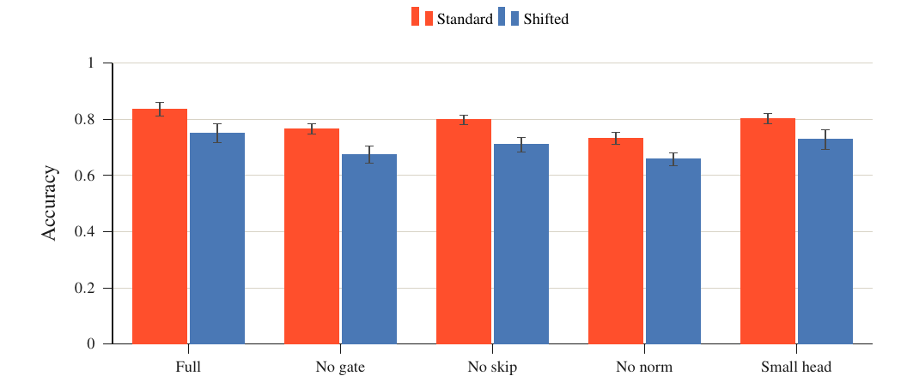
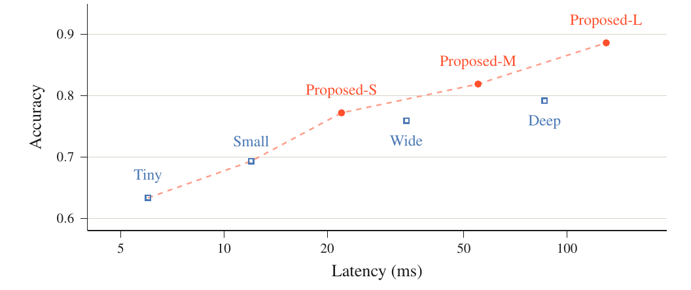

# research-paper-figures

Publication figures for any paper or dataset, using TikZ/pgfplots or Matplotlib.
Includes serif typography, coral emphasis, compact solid bars, readable heatmaps,
drawn method diagrams, and captions that explain the takeaway.

The skill is in [skills/research-paper-figures](skills/research-paper-figures/SKILL.md).
See the repository's installation instructions to enable the plugin. It activates
for research plots, figure restyling, and paper-ready comparisons.

## Visual examples

Eight synthetic references cover curves, bars, scatter plots, diagrams, category
comparisons, distributions, heatmaps, and spatial fields. They preserve the visual
style without including personal data or an existing manuscript.




## Build the gallery

Requires Python 3.10+, NumPy, Matplotlib, Pillow, a LaTeX distribution with
pgfplots and standalone, and Poppler's `pdftoppm`.

```bash
python -m pip install -r skills/research-paper-figures/requirements.txt
python skills/research-paper-figures/scripts/build_gallery.py --output gallery-output
```

Outputs include PDF figures, PNG previews, synthetic data, and a captioned
`gallery.pdf`. Font discovery is platform-independent. The style prefers Times
and reports the selected substitute when that font is unavailable.

## Tests

```bash
python -m unittest discover -s tests -v
```

The repository also runs the complete gallery on Linux. MIT licensed under the
repository's [LICENSE](../../LICENSE).
